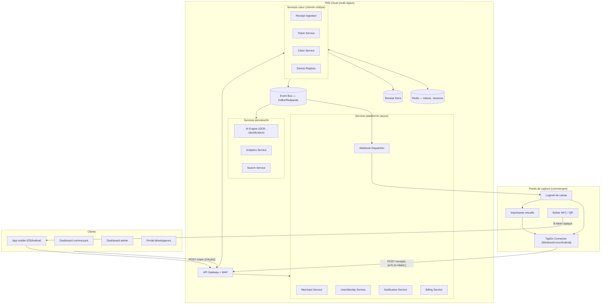
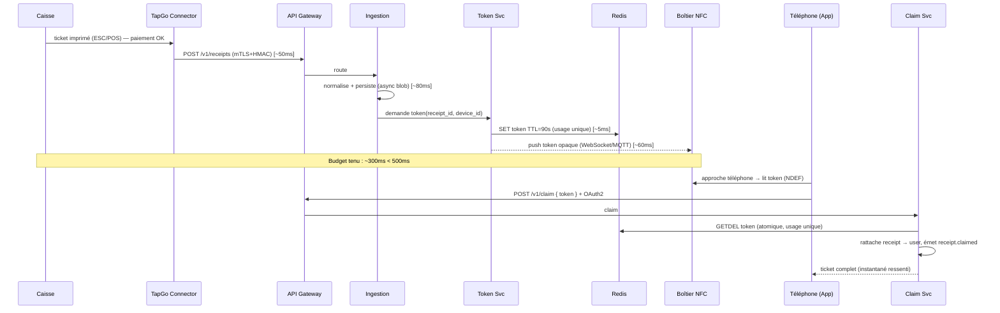

# TapGo Receipt Network (TRN) — Phase 1 : Architecture

> Document d'architecture fondateur. Statut : **PROPOSÉ — en attente de validation.**
> Auteur : CTO / Software Architect. Version : 0.1. Date : 2026-07-15.
> Aucun code applicatif n'est produit tant que ce document n'est pas validé.

---

## 0. Note du CTO — ce que je recommande de changer dans le brief

Tu m'as demandé de raisonner comme un CTO et de te dire si une meilleure voie existe. Voici mes 6 recommandations structurantes **avant** d'entrer dans le détail. Elles ne réduisent pas l'ambition — elles la rendent atteignable.

1. **Séquencer, pas tout construire.** Le brief liste ~15 domaines fonctionnels (tickets, factures, garanties, fidélité, ERP, banques, assurances, fisc…). Construire tout en parallèle = échec garanti. Le cœur de valeur — et le seul « moat » réel — c'est **la boucle : caisse → token → NFC/QR → ticket dans le téléphone en < 500 ms.** Tout le reste (IA, ERP, fidélité) se branche *après*, sur une donnée déjà captée. On construit d'abord le tuyau, ensuite les services au-dessus.

2. **« Stripe des tickets » ⇒ l'intégration est le produit, pas l'app.** Stripe a gagné avec 7 lignes de code d'intégration. Notre priorité n°1 n'est pas l'app mobile jolie, c'est le **connecteur qui capte le ticket sans que le commerçant change son logiciel de caisse**. D'où le poids stratégique de l'imprimante virtuelle Windows (capture zéro-intégration) dès le début.

3. **GraphQL : plus tard.** REST + Webhooks d'abord. GraphQL ajoute une surface d'attaque, une complexité de cache et de rate-limiting non triviale, pour un bénéfice nul tant qu'on n'a pas de clients avec des besoins de requêtage complexes. On l'ajoutera en Phase 6 pour le portail développeurs. **REST-first.**

4. **Ne pas fabriquer de hardware trop tôt.** Concevoir le firmware NFC : oui. Commander une usine de boîtiers : non, tant que le protocole token n'est pas éprouvé. Un **smartphone Android en mode « host card emulation » (HCE) ou un simple sticker NFC réinscriptible + un Raspberry Pi** suffisent pour le pilote. Le boîtier ESP32 dédié vient quand le protocole est figé. Cela évite d'immobiliser du capital sur du matériel qui pourrait changer.

5. **Le token ne doit JAMAIS transiter par un canal non authentifié en clair.** Le brief dit « le boîtier ne contient qu'un token temporaire ». Correct, mais insuffisant : un token à usage unique lisible par n'importe quel téléphone qui passe devant le boîtier = risque de vol de ticket par un tiers. La conception ci-dessous (§7) résout ça avec un token **opaque, lié au terminal, à TTL très court (~60–120 s), à usage unique, et réclamé via un appel serveur authentifié** — le NFC ne porte qu'un pointeur, jamais la donnée.

6. **Conformité dès le design, pas après.** RGPD (UE) + LPD (Suisse, révisée 2023) imposent : minimisation, base légale claire, résidence des données, droit à l'effacement. Un ticket = donnée personnelle (habitudes de consommation). On conçoit le stockage **chiffré, partitionné par région, effaçable** dès la Phase 2. Rattraper ça après = refonte coûteuse.

**Ma proposition de trajectoire :** un **MVP « thin slice » vertical** (un seul flux, de bout en bout, en production) en Phase 2, puis élargissement. Détail en §10.

---

## 1. Architecture globale

### 1.1 Style architectural

- **Microservices** organisés par *bounded contexts* (Domain-Driven Design), déployés sur Kubernetes.
- **Communication** : synchrone REST/gRPC pour le chemin critique ; **asynchrone via un bus d'événements** (Kafka/Redpanda) pour tout le reste (IA, analytics, webhooks, exports). C'est ce qui permet de tenir le SLA < 500 ms : le chemin critique fait le strict minimum, le reste se fait en tâche de fond.
- **API Gateway** en façade (auth, rate-limiting, routage, TLS termination).
- **Event-driven + CQRS léger** là où la lecture et l'écriture ont des profils très différents (ex. : écriture de tickets massive, lecture analytique).

### 1.2 Vue d'ensemble (C4 — niveau conteneurs)



---

## 2. Stack technologique (avec justifications)

| Couche | Choix | Justification |
|---|---|---|
| **Langage services cœur** | **Go** | Latence faible et prévisible (GC court), concurrence native, binaires légers → idéal pour le chemin critique < 500 ms et des millions de requêtes. |
| **Langage services métier/IA** | **TypeScript (NestJS)** + **Python** (IA/OCR) | Vélocité produit en TS ; écosystème ML/OCR mûr en Python. |
| **API Gateway** | **Envoy** (via **Kong** ou **APISIX**) | mTLS, rate-limiting, authz, observabilité standard. |
| **Bus d'événements** | **Redpanda** (compatible Kafka) | Débit élevé, faible latence, sans ZooKeeper → simple à opérer à grande échelle. |
| **Base transactionnelle** | **PostgreSQL** (via **CloudNativePG** / Aurora / AlloyDB) | ACID, robuste, JSONB pour les tickets semi-structurés, partitionnement. |
| **Store tickets (volume)** | **PostgreSQL partitionné** + **object storage (S3/GCS)** pour les originaux (PDF/images) | Métadonnées en SQL, blobs en stockage objet chiffré. |
| **Cache / tokens** | **Redis** (cluster) | TTL natif, atomicité (usage unique via `GETDEL`/Lua), latence sub-ms. |
| **Recherche** | **OpenSearch** | Recherche plein texte + filtres pour l'historique client. |
| **Analytics** | **ClickHouse** | Agrégations analytiques massives (dashboards, milliards de lignes). |
| **Orchestration** | **Kubernetes** (EKS/GKE) + **ArgoCD** (GitOps) | Standard, multi-cloud, scalabilité horizontale. |
| **IaC** | **Terraform** + **Helm** | Infra reproductible, multi-région. |
| **Observabilité** | **OpenTelemetry** + **Prometheus/Grafana** + **Loki** + **Tempo** | Traces distribuées indispensables pour tenir/mesurer le SLA. |
| **Secrets** | **HashiCorp Vault** (ou cloud KMS) | Rotation de clés, HMAC, signature. |
| **Mobile** | **React Native (Expo)** ou **Flutter** | Un seul code base iOS/Android. **Recommandation : Flutter** pour la perf NFC/UI et le contrôle bas niveau. Décision ouverte (§11). |
| **Firmware NFC** | **ESP-IDF (C)** sur **ESP32** | Support Wi-Fi + NFC, OTA, faible coût, communauté. |
| **Connecteur Windows** | **.NET 8 (C#)** service Windows + **Rust** pour le driver d'imprimante virtuelle | .NET = intégration Windows native ; Rust = fiabilité au niveau driver. |
| **Frontend web (dashboards/portail)** | **Next.js (React) + TypeScript** | SSR, écosystème, rapidité de dev. |
| **CI/CD** | **GitHub Actions** + ArgoCD | Le repo est déjà sur GitHub (`metin427/ticket-de-caisse`). |

**Cloud** : architecture *cloud-agnostic* (Kubernetes + Terraform), déploiement initial sur **un** fournisseur (recommandation : **GCP** pour AlloyDB + réseau mondial, ou AWS pour maturité). Multi-région actif-actif pour la HA 99,99 %.

---

## 3. Microservices (bounded contexts)

Chaque service = base de données propre (database-per-service), déployable indépendamment.

### Services cœur (chemin critique, Go)
1. **Receipt Ingestion Service** — reçoit les tickets des caisses (REST, batch, imprimante virtuelle). Valide, normalise (modèle canonique), persiste, émet `receipt.created`.
2. **Token Service** — génère/valide les tokens opaques à usage unique (voir §7). S'appuie sur Redis.
3. **Claim Service** — associe un token à un utilisateur → rattache le ticket au compte. Émet `receipt.claimed`.
4. **Device Registry** — enregistre boîtiers NFC, terminaux de caisse, connecteurs ; gère leurs clés/certificats et leur état (OTA, diagnostic).

### Services plateforme (TypeScript/NestJS)
5. **Identity/User Service** — comptes clients, auth (Google/Apple/Facebook/Email/Téléphone), OAuth2/OIDC, RBAC.
6. **Merchant Service** — commerçants, boutiques, abonnements, clés API, membres.
7. **Notification Service** — push (FCM/APNs), email, SMS.
8. **Webhook Dispatcher** — livraison fiable des événements aux systèmes tiers (retry, signature HMAC, DLQ).
9. **Billing Service** — abonnements SaaS, facturation à l'usage de l'API, vente/location de boîtiers (intégration Stripe).

### Services données / IA (Python + Go)
10. **AI Engine** — OCR (tickets scannés/PDF), classification des achats, détection abonnements/doublons, extraction structurée.
11. **Analytics Service** — métriques dashboards (ClickHouse).
12. **Search Service** — indexation et recherche de l'historique (OpenSearch).

> **Anti-pattern évité** : on ne crée PAS un microservice par entité (facture, garantie, coupon…). Ces domaines sont d'abord des *types de documents* dans le Receipt Store avec un `document_type`. On extraira des services dédiés seulement quand un domaine aura sa propre logique métier lourde. *Start modular monolith-ish, split when it hurts.*

---

## 4. Bases de données

| Service | Store | Contenu clé |
|---|---|---|
| Receipt Ingestion / Store | PostgreSQL (partitionné par date + région) + S3/GCS (blobs) | Tickets normalisés (JSONB), lignes d'articles, originaux chiffrés |
| Token Service | Redis (cluster, persistance AOF) | `token → {receipt_id, device_id, exp, used}` TTL 60–120 s |
| Claim Service | PostgreSQL | Liens ticket↔utilisateur, journal des claims |
| Identity/User | PostgreSQL | Utilisateurs, identités fédérées, consentements RGPD |
| Device Registry | PostgreSQL | Boîtiers, terminaux, certificats, firmware version |
| Merchant | PostgreSQL | Commerçants, boutiques, clés API (hashées) |
| Analytics | ClickHouse | Événements agrégés |
| Search | OpenSearch | Index tickets |
| Billing | PostgreSQL (+ Stripe comme source de vérité paiement) | Abonnements, usage |

**Modèle canonique du ticket (extrait) :**

```jsonc
{
  "receipt_id": "rcpt_...",           // ULID
  "document_type": "receipt",         // receipt | invoice | warranty | coupon ...
  "merchant": { "id": "...", "store_id": "...", "name": "...", "country": "CH" },
  "issued_at": "2026-07-15T20:41:00Z",
  "currency": "CHF",
  "totals": { "gross": 47.90, "tax": 3.55, "net": 44.35 },
  "lines": [
    { "label": "Café", "qty": 2, "unit_price": 4.50, "tax_rate": 0.081, "amount": 9.00 }
  ],
  "payment": { "method": "card", "masked_pan": "•••• 4242" },
  "source": { "channel": "virtual_printer", "connector_id": "...", "raw_format": "escpos" },
  "region": "eu-ch",
  "pii_class": "personal"
}
```

**Résidence des données** : partitionnement par `region` (ex. `eu-ch`, `eu-west`, `us`). Un ticket suisse reste stocké dans la région suisse/UE. Clé de chiffrement par région (KMS).

---

## 5. API

### 5.1 Principes
- **REST-first**, versionné (`/v1`), JSON, idempotence sur les écritures (header `Idempotency-Key`).
- **Auth** : OAuth2 (clients), API Keys + **signature HMAC** (connecteurs machine-to-machine), OIDC (utilisateurs mobiles).
- **Webhooks signés** pour l'événementiel sortant.
- **GraphQL** différé (Phase 6, portail dev).

### 5.2 Endpoints principaux (v1)

```
# Ingestion (connecteurs / caisses — mTLS + HMAC)
POST   /v1/receipts                 # créer un ticket → renvoie receipt_id + token de claim
POST   /v1/receipts:batch           # ingestion en lot
GET    /v1/receipts/{id}
GET    /v1/receipts                  # liste filtrable (merchant/user scope)

# Token & Claim (chemin critique)
POST   /v1/tokens                    # (interne) générer un token pour un receipt+device
POST   /v1/claim                     # { token } + auth utilisateur → rattache le ticket
GET    /v1/claim/{token}/status      # état (pour QR/polling)

# Commerçant
POST   /v1/merchants
POST   /v1/merchants/{id}/stores
POST   /v1/merchants/{id}/api-keys

# Devices
POST   /v1/devices                   # enregistrer un boîtier NFC / connecteur
POST   /v1/devices/{id}/heartbeat
GET    /v1/devices/{id}/firmware     # OTA

# Domaines métier (async au-dessus du ticket)
POST   /v1/refunds
POST   /v1/loyalty
POST   /v1/promotions
GET    /v1/analytics

# Webhooks
POST   /v1/webhooks                  # s'abonner à des events
```

### 5.3 Événements (bus)
`receipt.created`, `receipt.claimed`, `receipt.enriched` (post-IA), `refund.created`, `device.offline`, `token.expired`… Consommés par IA, Analytics, Webhook Dispatcher, Notification.

---

## 6. Flux de données — le chemin critique (< 500 ms)

C'est LE flux qui doit tenir le SLA. Objectif : du « paiement validé » à « token disponible sur le boîtier », **budget < 500 ms** ; le rattachement au compte client se fait ensuite côté téléphone (hors budget des 500 ms, mais ressenti instantané).



**Points de conception clés :**
- La persistance du **blob original** (PDF/image) est **asynchrone** ; le chemin critique ne persiste que les métadonnées.
- Le **push vers le boîtier** utilise une connexion persistante (WebSocket ou MQTT) déjà ouverte → pas de coût d'établissement.
- **Fallback QR** : si l'app détecte l'absence de NFC (ou échec), le boîtier/écran affiche un QR encodant le même token opaque ; le claim est identique.
- **Dégradation** : si le push temps réel échoue, le boîtier interroge (`long-poll`) `GET /devices/{id}/pending-token`.

---

## 7. Conception du boîtier NFC & du protocole token (cœur de sécurité)

### 7.1 Principe
Le boîtier **ne stocke jamais le ticket**. Il ne porte qu'un **token opaque** (un pointeur aléatoire, ex. 256 bits base32) écrit dans un enregistrement **NDEF** (URI `https://tap.go/c/<token>` ou record externe). Le ticket reste dans le cloud.

### 7.2 Propriétés de sécurité du token
- **Opaque** : aucune donnée métier dedans (pas de JWT lisible côté NFC). Le mapping token→ticket vit uniquement dans Redis côté serveur.
- **TTL très court** : 60–120 s. Après expiration → `token.expired`, illisible.
- **Usage unique** : consommé atomiquement au claim (`GETDEL` Redis). Un 2ᵉ tap échoue.
- **Lié au terminal** (`device_id`) : le serveur vérifie que le token a bien été émis pour ce boîtier.
- **Anti-rejeu (replay)** : nonce + usage unique + TTL. Un token capturé/rejoué est inutilisable.
- **Fenêtre de collision minimisée** : un seul token « pending » actif par boîtier à la fois ; le nouveau ticket écrase l'ancien.

> **Risque résiduel identifié (honnêteté CTO)** : entre l'émission et le tap, un attaquant physiquement présent devant le boîtier pourrait lire le token et le réclamer avant le vrai client. Mitigations : TTL court, exigence d'auth utilisateur au claim (le voleur récupère un ticket anonyme sans valeur pour lui + traçabilité), et option « confirmation commerçant » pour montants élevés / documents sensibles (factures). À arbitrer avec toi selon le niveau de menace visé.

### 7.3 Firmware (ESP32, ESP-IDF)
Fonctions : connexion Wi-Fi + canal persistant (MQTT/WSS mTLS) au cloud, réception du dernier token, écriture NDEF (PN532/ST25), **LED** (état), **buzzer** (tap réussi), **OTA** signé, **mode diagnostic**, **mode hors ligne** (buffer + reconnexion auto), heartbeat.

> **Recommandation pilote** : valider le protocole avec un **Raspberry Pi + lecteur/écriveur NFC** et/ou **HCE Android** avant de figer le hardware ESP32 (cf. §0.4).

---

## 8. Connecteur Windows — « TapGo Connector »

Service Windows (.NET 8) tournant en arrière-plan, **zéro intervention utilisateur** :
- **Démarrage automatique** (service Windows), auto-update signé.
- **Détection** des imprimantes, des logiciels de caisse, des flux d'impression.
- **Capture** du ticket (voir §9) → normalisation → `POST /v1/receipts` (mTLS + HMAC).
- **Résilience** : file locale chiffrée si hors ligne, renvoi à la reconnexion.
- **Mode diagnostic** + logs structurés + auto-enregistrement au Device Registry.
- Multi-plateforme : version **Linux** (daemon) et **Android POS** (service) partageant le cœur (.NET / Kotlin).

---

## 9. Imprimante virtuelle Windows

**Objectif stratégique** : capture **zéro-intégration** — le commerçant n'installe rien dans son logiciel de caisse, il imprime « normalement ».

- Driver d'imprimante virtuelle (recommandé : base **RedMon / port monitor** ou driver **v4 XPS**, cœur en **Rust** pour la fiabilité).
- À chaque impression : (1) **copie numérique** du flux (ESC/POS, RAW, PDF, TXT, image), (2) envoi au connecteur → cloud, (3) **l'impression papier continue normalement** (pass-through — critique pour ne pas casser l'existant).
- Parsing **ESC/POS** (Epson, Star, Sunmi, Elo) → modèle canonique ; PDF/image → pipeline OCR (AI Engine).
- Formats : ESC/POS, RAW, PDF, TXT, images.

---

## 10. Roadmap détaillée

Principe (ta règle) : **une phase à la fois — conçue, développée, testée, documentée, validée** avant la suivante.

| Phase | Objectif | Livrables | Sortie |
|---|---|---|---|
| **1. Architecture** *(en cours)* | Fonder l'architecture | Ce document, ADRs, schémas | ✅ à valider |
| **2. MVP « thin slice »** | 1 flux bout-en-bout **en prod** : imprimante virtuelle → ingestion → token → claim QR → app minimale | Ingestion+Token+Claim (Go), imprimante virtuelle basique (ESC/POS), app mobile squelette (claim QR), infra K8s + CI/CD | Un vrai ticket capté et rattaché à un compte |
| **3. NFC + app** | Ajouter NFC (boîtier pilote RPi/HCE), app complète (historique, auth multi-provider, offline) | Firmware pilote, app iOS/Android publiable | Tap NFC fonctionnel |
| **4. Boîtier ESP32** | Industrialiser le hardware | Firmware ESP32 (OTA, LED/buzzer, diag), Device Registry complet | Boîtier utilisable en boutique |
| **5. Connecteur & captures** | Élargir l'ingestion | Connecteur Windows/Linux/Android, imprimante virtuelle complète, imports XML/JSON/CSV/PDF | Intégration « plug » multi-caisse |
| **6. Plateforme commerciale** | Monétiser & ouvrir | Dashboards commerçant/admin, portail dev (OpenAPI/Swagger, sandbox, clés, webhooks), Billing (Stripe), GraphQL | Onboarding self-service |
| **7. IA** | Enrichir la donnée | OCR, classification, abonnements, doublons, budgets, recommandations | Valeur analytique |
| **8+. Expansion** | Factures, garanties, fidélité, coupons, ERP, exports comptables, banques/assurances/fisc | Services dédiés au-dessus du socle | Écosystème |

**Jalons non-fonctionnels transverses** : SLO < 500 ms (p99 chemin critique), 99,99 % dispo (multi-région actif-actif), conformité RGPD/LPD auditée, tests de charge (objectif : plusieurs milliards de tickets/an ≈ ~100k+ écritures/s en pointe → dimensionnement Kafka/Redpanda + Postgres partitionné + autoscaling).

---

## 11. Décisions ouvertes (j'ai besoin de ton arbitrage)

1. **Cloud** : GCP (recommandé, AlloyDB + réseau mondial) vs AWS (maturité) vs Azure ?
2. **Mobile** : Flutter (ma reco) vs React Native ?
3. **Marché initial** : Suisse d'abord (LPD, petit marché maîtrisable) puis UE ? Ça fixe la région de données par défaut.
4. **Modèle NFC pilote** : on valide sur RPi/HCE avant ESP32 (ma reco) — OK ?
5. **Niveau de menace token** : accepte-t-on le risque résiduel §7.2 avec TTL court + auth claim, ou exige-t-on une confirmation commerçant pour tout ?
6. **Budget/équipe** : as-tu des contraintes (solo / petite équipe / budget cloud) ? Ça change le curseur « build vs. managed services ».

---

## 12. Résumé exécutif

- **Ce qu'on construit d'abord** : le tuyau caisse→token→NFC/QR→app, pas la totalité des 15 domaines.
- **Stack** : Go (cœur temps réel), TypeScript/Python (plateforme/IA), PostgreSQL + Redis + Redpanda + ClickHouse, Kubernetes + Terraform, REST-first.
- **Sécurité** : token opaque, usage unique, TTL court, lié au terminal, claim authentifié ; le NFC ne porte jamais le ticket.
- **Différenciateur** : capture **zéro-intégration** via imprimante virtuelle + connecteur.
- **Conformité** : RGPD/LPD *by design*, données partitionnées et chiffrées par région.
- **Trajectoire** : MVP vertical en prod (Phase 2) puis élargissement phase par phase.

**➡️ Prochaine étape : ta validation de cette architecture + tes réponses au §11. Sur ton feu vert, je démarre la Phase 2 (MVP thin slice) — conçue, développée, testée, documentée.**
